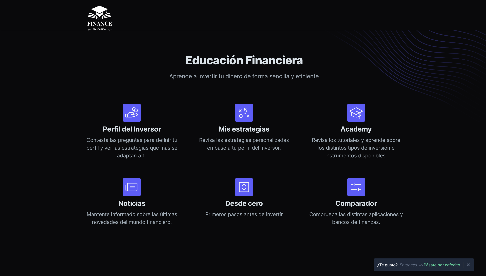

# Finance Education Web App

<p align="center">
  
</p>


## Table of Contents

- [Introduction](#introduction)
- [Features](#features)
- [Getting Started](#getting-started)
  - [Prerequisites](#prerequisites)
  - [Installation](#installation)
- [Usage](#usage)
- [Contributing](#contributing)
- [License](#license)

## Introduction

The Finance Education web app is designed to provide users with a platform to learn about finance, assess their risk profile, and plan their finances based on their income. Whether you are a beginner looking to understand the basics of finance or an experienced investor wanting to optimize your financial strategy, this app can help you make informed decisions.



Key features of the app include risk profile assessment, income analysis, and educational resources to enhance your financial literacy.

## Features

- **Risk Profile Assessment:** Evaluate your risk tolerance and receive personalized financial recommendations.
- **Income Analysis:** Analyze your income sources and learn how to manage them effectively.
- **Educational Resources:** Access a library of educational materials, articles, and guides on various financial topics.
- **Interactive Tools:** Use interactive calculators and planners to create financial goals and track your progress.

## Getting Started

### Prerequisites

Before you begin, ensure you have met the following requirements:

- [Node.js](https://nodejs.org/) installed on your system.
- [Git](https://git-scm.com/) for version control.

### Installation

To get the Finance Education web app up and running, follow these steps:

1. Clone the repository:

   ```bash
   git clone https://github.com/matiasvidela96/Finance-Education.git
   
2. Change to the project directory::

   ```bash
   cd Finance-Education
   
3. Install the required dependencies:

   ```bash
   npm install
   
4. Start the development server:

   ```bash
   npm run dev
   
The app will be accessible at http://localhost:3000.

## Usage
- Visit the web app in your browser at http://localhost:3000.
- Create an account or log in if you already have one.
- Explore the risk profile assessment tool, income analysis, and educational resources.
- Use the interactive tools and calculators to plan your financial goals.

## Contributing

Contributions are welcome! If you'd like to contribute to this project, please follow these guidelines:

- Fork the repository.
- Create a new branch for your feature or bug fix.
- Make your changes and commit them with descriptive messages.
- Push your branch to your forked repository.
- Create a pull request to merge your changes into the main repository.

Please ensure your code adheres to the project's coding standards and includes appropriate documentation.

## License

This project is licensed under the [MIT](https://nodejs.org/) License - see the LICENSE file for details.
